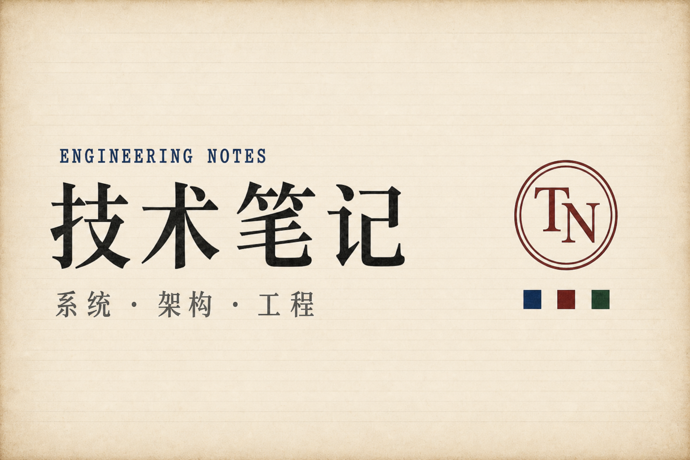

<div align="center">



<br>

<a href="https://kavinchan13.github.io/tech-notes/">
  
</a>
&nbsp;
<a href="./LICENSE">
  
</a>
&nbsp;


</div>

<br>

A slowly-growing library of working notes on **C++ internals, systems, software architecture, and engineering management** — accumulated from day-to-day work and kept as a single static site. Each page is a self-contained HTML file with no build step, no framework, and no telemetry. Open one in a browser and read it.

The whole collection lives at **[kavinchan13.github.io/tech-notes](https://kavinchan13.github.io/tech-notes/)**.

<br>

---

### What's in here

It started as scattered C++ debugging notes and, over time, grew into ten folders that roughly mirror how the work is organized in practice:

| Folder | What it covers |
|---|---|
| [`cpp/`](./cpp) | Language internals — compilation, object & memory model, value categories, templates, coroutines, smart pointers, the LLVM toolchain, sanitizer internals, modern CMake, concurrency. |
| [`stl/`](./stl) | Containers and algorithms, design patterns rewritten in modern C++, concurrency patterns. |
| [`perf-debug/`](./perf-debug) | Performance, low-latency, leak hunting, crash and deadlock debugging, sanitizers, ABI compatibility, hardening, observability, modern libraries. |
| [`system/`](./system) | Linux kernel IO, file descriptors, OS fundamentals, networking, async network frameworks. |
| [`architect/`](./architect) | Software architecture methodology, large-scale C++ engineering, distributed systems, storage, observability, plus a capstone walking through one design end-to-end. |
| [`ai-native/`](./ai-native) | Working with LLMs — 15 guides covering Transformer internals, training (Pretrain/SFT/RLHF/DPO/GRPO), RAG, MCP & Skills, multimodal, embedding & vector search, evaluation, AI coding agents (Cursor/Devin/Claude Code), AI career landscape, and an AI math cheatsheet. |
| [`ai-infra/`](./ai-infra) | The infrastructure underneath — 5 deep dives on CUDA for C++ engineers, vLLM/PagedAttention/Continuous Batching, distributed training (DDP/FSDP/Megatron/3D parallel), quantization (INT4/FP8/GPTQ/AWQ), and AI compilers (torch.compile/XLA/TVM/Triton/MLIR). |
| [`embedded-realtime/`](./embedded-realtime) | Real-time and automotive C++ — PREEMPT_RT, AUTOSAR AP, ISO 26262, vehicle networking. |
| [`management/`](./management) | Engineering management notes and a small set of EM templates (1:1, weekly, postmortem, hiring scorecard, ADR). |
| [`pm/`](./pm) | A parallel track for project and product management, with a matching template library. |
| [`interview/`](./interview) | A long-form Tech Lead guide plus interactive flashcard apps — C++, architect, EM, PM, and **AI engineer (120 cards across 9 topics)**, plus an AI system design playbook (15 problems) and an AI Tech Lead / EM interview guide. All cards have search, filters, and progress saved in `localStorage`. The full **30/60/90 day AI engineer study path** lives [here](./interview/ai_study_path.html). |

<br>

---

### Where to start

A handful of pages are good entry points if nothing in particular brought you here:

- [The C++ object model](https://kavinchan13.github.io/tech-notes/cpp/object_model.html) — vtables, multiple inheritance, EBO, and the things that keep slipping out of memory.
- [Low-latency programming](https://kavinchan13.github.io/tech-notes/perf-debug/low_latency_guide.html) — lock-free, kernel bypass, hardware timestamping.
- [Architect capstone](https://kavinchan13.github.io/tech-notes/architect/architect_capstone.html) — one design walkthrough, from requirements to ADRs to storage.
- [Transformer & modern LLM architecture](https://kavinchan13.github.io/tech-notes/ai-native/transformer_llm_architecture.html) — Attention, KV-Cache, RoPE, GQA→MLA, MoE, with life analogies and interactive demos.
- [vLLM inference deep dive](https://kavinchan13.github.io/tech-notes/ai-infra/inference_serving.html) — PagedAttention, Continuous Batching, source-code tour. The C++ veteran's strongest leverage into AI.
- [AI career landscape](https://kavinchan13.github.io/tech-notes/ai-native/ai_career_landscape.html) — 6 AI roles, salary bands, JD decoder, 10 reject signals, STAR story templates.
- [AI engineer 30/60/90 study path](https://kavinchan13.github.io/tech-notes/interview/ai_study_path.html) — week-by-week plan with 3 tracks (AI Infra / LLM App / ML Research).
- [EM templates](https://kavinchan13.github.io/tech-notes/management/em-templates/) — copy-paste 1:1s, weeklies, postmortems, hiring scorecards.

<details>
<summary>Looking for the full index? It's on the site, not in this README.</summary>

<br>

The README used to carry the full table of contents, which got long. The canonical index now lives at **[kavinchan13.github.io/tech-notes](https://kavinchan13.github.io/tech-notes/)**, with proper navigation, search, and the reading-time strip on every page.

</details>

<br>

---

### Running it locally

Every page is plain HTML, so cloning and opening `index.html` directly works. For something closer to the deployed site, run a static server:

```bash
git clone https://github.com/kavinChan13/tech-notes.git
cd tech-notes

# pick one
python -m http.server 8080
npx serve .
```

Then visit `http://localhost:8080/`.

<br>

---

### Deployment

[`.github/workflows/pages.yml`](./.github/workflows/pages.yml) publishes the site to GitHub Pages on every push to `main`. There is no build step — the workflow uploads the repo as-is.

```bash
git add .
git commit -m "docs: …"
git push
```

A minute or two later the change is live.

<br>

---

### A note on how this is written

Some of the longer guides were drafted with AI assistance and then edited, restructured, and verified by hand before being committed. They are personal notes, not the official position of any employer, client, or organization, and they should not be relied on as legal, safety, or certification advice. Where standards or trademarks are mentioned — PMBOK, AUTOSAR, ISO, IEC, MISRA, and so on — they belong to their respective owners and appear here only for descriptive reference.

<br>

<div align="center">

<sub>[MIT](./LICENSE) © 2026 Kavin Chan</sub>

</div>
